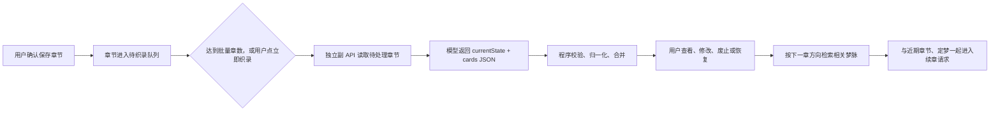

# 千夜浮梦「梦脉」设计与二创讨论稿

> 用途：供禾禾与小澄讨论梦脉的定位、数据结构、提示词、用户主权和二创预设方案。
> 当前实现基线：千夜浮梦 `v3.6.3`，分支 `codex/long-dream-preview`，提交 `6190a6b`。
> 更新时间：2026-08-08。
> 本文描述的是当前真实实现，不代表最终产品方案。

---

## 一、先说结论：梦脉到底是什么

梦脉是长梦的“连续性记忆层”。

它的目的不是替代章节原文，也不是再造一份世界书，而是在长卷写到几十章以后，帮助续章模型快速找回真正会影响后文的事实，例如：

- 人物此刻在哪里、受了什么伤、正在隐瞒什么。
- 两个人目前是什么关系，关系在第几章发生过什么变化。
- 某个角色已经经历过哪些会改变其性格、选择或人生轨迹的事件。
- 哪个伏笔尚未兑现，哪个约定已经完成或失效。
- 某个物品现在由谁持有、放在哪里、是否已经损坏。
- 本梦世界线相对原世界线发生了什么偏离，以及哪些原设定不能再默认成立。
- 值得保留原句的关键对白、誓言、称呼或信息。

梦脉不是：

- **不是定梦 `canon`**：定梦是用户亲自确认的最高级硬事实，AI 不能修改；梦脉是从已保存章节提取的连续性辅助资料。
- **不是章节摘要合集**：不应该每章机械生成一段流水账，也不应该用摘要替代章节原文。
- **不是原世界书**：默认隔离的长梦不会读取原世界书；明确继承时也只使用开卷时冻结的快照。
- **不是模型自由发挥的设定集**：只能记录章节中已经发生、可以回章核对的事实。
- **不是绝对权威**：梦脉若与用户定梦或已保存章节冲突，应以定梦和章节为准。

### 当前权威顺序

从高到低：

1. 用户本章明确要求。
2. 用户确认的此梦设定 `canon`。
3. 已经确认保存的长梦章节。
4. 用户人工校正后的梦脉。
5. AI 自动织录的梦脉。
6. 用户明确允许的冻结世界书快照。

其中第 4、5 层目前在数据上都属于梦脉卡片，只通过 `editedByUser` 区分是否经过人工修改。

---

## 二、梦脉在整个长梦流程中的位置



### 当前自动织录行为

- 只有“确认保存”为正式章节的内容才会进入梦脉队列。
- 默认累计 **3 章**后自动织录，也可设置为每 1、3、5 章。
- 用户可以手动点击“立即织录”。
- 梦脉使用单独绑定的副 API，不复用正文生成线路。
- 梦脉失败不会阻止章节保存、阅读或继续续章。
- 页面刷新打断织录后，会恢复为“待织录”，不会永久卡在处理中。
- 回退、删除或创建新时间线后，失效梦脉会被清空，保留章节重新进入织录队列。

---

## 三、当前长梦中的梦脉总结构

每部长梦里都有一个 `memory` 对象：

```json
{
  "status": "pending",
  "cards": [],
  "currentState": "",
  "processedThroughChapter": 0,
  "pendingChapterNumbers": [1, 2, 3],
  "updatedAt": "2026-08-08T00:00:00.000Z",
  "lastErrorSignal": ""
}
```

### 字段说明

| 字段 | 作用 | 当前行为 |
| --- | --- | --- |
| `status` | 梦脉处理状态 | `not-started`、`pending`、`weaving`、`ready`、`failed` |
| `cards` | 结构化梦脉卡片 | 保存人物状态、关系、事件、伏笔等事实 |
| `currentState` | 当前脉象 | 一段总览当前时间、地点、人物与关系状态的文本 |
| `processedThroughChapter` | 已处理到第几章 | 用于判断哪些章节还需要送去织录 |
| `pendingChapterNumbers` | 待织录章节号 | 章节确认保存后自动加入 |
| `updatedAt` | 最近更新时间 | ISO 时间字符串 |
| `lastErrorSignal` | 最近一次失败信号 | 只保存脱敏错误信号，不保存 API 回显正文 |

### `currentState` 当前的角色

`currentState` 是“截至目前的整体脉象”，主要用于快速告诉续章模型：

- 故事当前处于什么时间点。
- 核心人物当前在哪里。
- 核心人物当前关系和行动状态是什么。
- 目前正在推进的主要局面是什么。

它会完整进入续章请求，不参与最多 30 条卡片的相关性筛选。

当前设置页允许用户人工修改 `currentState`，但它还没有独立的“人工锁定”标记。这意味着下一次 AI 织录返回新的 `currentState` 时，仍可能覆盖用户手改版本。这是当前需要重点讨论的问题之一。

---

## 四、单张梦脉卡片的当前结构

```json
{
  "id": "memory-12-abc-1",
  "type": "人物状态",
  "key": "林岚/所在地点",
  "content": "林岚目前位于旧港钟楼顶层。",
  "chapterId": "chapter-12",
  "chapterNumber": 12,
  "sourceChapterNumbers": [9, 12],
  "quote": "我会在钟声停下以前回来。",
  "status": "active",
  "tags": ["林岚", "旧港", "钟楼"],
  "editedByUser": false,
  "updatedAt": "2026-08-08T00:00:00.000Z"
}
```

### 卡片字段说明

| 字段 | 作用 | 当前限制或规则 |
| --- | --- | --- |
| `id` | 卡片本地标识 | 自动生成；备份导入时会安全归一化 |
| `type` | 事实分类 | 当前只有 9 种内置分类 |
| `key` | 可变化状态的稳定槽位 | 用于原位更新，例如“林岚/所在地点” |
| `content` | 当前有效事实 | 最多保留 1200 字符；不能为空 |
| `chapterId` | 主要来源章节 ID | 当前通常根据 `chapterNumber` 自动生成 |
| `chapterNumber` | 本次事实的主要来源章 | AI 只能填本次待织录章节号 |
| `sourceChapterNumbers` | 合并后的全部来源章 | 相同事实或同一状态槽更新时合并、去重、排序 |
| `quote` | 可选关键原句 | 最多 240 字符 |
| `status` | 是否进入后续请求 | 当前为 `active` 或 `dismissed` |
| `tags` | 检索关键词 | 最多 20 个，用于人物、地点、物品等命中 |
| `editedByUser` | 是否经过人工修改 | 人工编辑、废止、恢复都会设为 `true` |
| `updatedAt` | 最近更新时间 | 用于记录最后一次变动时间 |

---

## 五、当前九种梦脉分类

```text
人物状态
人生经历
关系
世界线偏离
伏笔/约定
地点/物品
事件
关键原话
事实
```

### 当前预期语义

| 分类 | 适合记录 | 不适合记录 |
| --- | --- | --- |
| 人物状态 | 所在地、伤势、身份暴露、正在执行的行动、持有信息 | 已经过去且不再影响当前的普通动作 |
| 人生经历 | 会长期改变人物性格、价值观、关系或选择的经历 | 每章流水账、普通吃饭睡觉 |
| 关系 | 关系性质、信任、敌意、承诺、公开或隐秘关系变化 | 纯粹气氛性互动 |
| 世界线偏离 | 原线事实、本梦改变、结果、失效默认 | 在完全隔离且没有原线参考时凭空猜原线 |
| 伏笔/约定 | 未解决线索、未兑现承诺、待回收因果 | 已经彻底解决但不再影响后文的事项 |
| 地点/物品 | 关键地点状态、物品归属、去向、损坏与用途 | 无后续价值的普通场景摆件 |
| 事件 | 已发生且会影响后续因果的重要事件 | 对剧情没有影响的日常动作罗列 |
| 关键原话 | 誓言、称呼、秘密、重要原句 | 普通对白全文搬运 |
| 事实 | 无法归入以上分类但必须持续记住的事实 | 用作所有不确定内容的垃圾桶 |

### 当前分类上的疑问

- “人物状态”和“人生经历”的边界容易混淆。
- “事件”和“人生经历”可能重复记录同一件事。
- “伏笔”和“约定”生命周期不同，但目前被合并为一个分类。
- “地点”和“物品”的状态逻辑不同，但目前被合并为一个分类。
- “事实”过于宽泛，模型容易把不确定内容都塞进这里。
- 当前没有独立的“不确定”“冲突”“已解决”“已失效”“因果链”字段。

---

## 六、当前实际使用的 System 提示词

下面是 `v3.6.3 / 6190a6b` 的完整原文：

```text
你负责“梦脉织录”：只从已经确认保存的章节中提取可核对的连续性事实。

规则：
1. 不续写、不润色、不替故事补全空白，不把推测写成事实；
2. 只记录会影响后续连载的人物状态、人生经历、关系、世界线偏离、伏笔/约定、地点/物品、事件与关键原话；
3. 此梦设定和已保存章节高于原世界书参考；发现冲突时记录“世界线偏离”，不能把原设定覆盖回来；
4. “世界线偏离”必须在 content 中依次写清：原线事实 → 本梦改变 → 直接结果 → 此后不能再默认成立的关系/经历；缺少原线参考时明确写“原线未知”，不得猜测；
5. 每条内容必须简短、明确，并标出来源章节；quote 只保留确有必要的短句；
6. 对“某人物的当前位置”“两人的当前关系”等会变化的状态，使用稳定 key；同一 type + key 的新事实会原位更新，而不是无限追加旧版本；
7. 只能输出合法 JSON，不输出 Markdown、代码围栏、解释或创作建议。
```

这段提示词目前可以在：

```text
设置 → API 与输出 → 梦脉织录 → 梦脉织录预设
```

直接修改，也可以一键恢复内置版本。

目前只能保存一段正在使用的文本，尚未提供“多个命名预设”“导入 JSON”“导出 JSON”或“预设作者信息”。

---

## 七、程序固定生成的 User 请求

只改 System 提示词不会改变以下数据输入和输出协议。程序会动态生成一个 `user` 请求，大体结构如下：

```text
【长梦】{长卷名称}

---

【与原世界线的关系】
{完全隔离 / 平行支线 / 前传补完 / 原线同期补完 / 正史后续的固定说明}

---

【此梦设定｜硬事实】
{用户确认的 canon}

---

【已有梦脉｜不得无声删除或改写】
当前脉象：{currentState}
- [人物状态｜林岚/所在地点｜来源第 9、12 章] 林岚目前位于旧港钟楼顶层。
- [关系｜林岚与周砚/当前关系｜来源第 6、10 章] 两人已经确认彼此信任，但尚未公开关系。

---

【原世界书参考｜权威低于此梦设定和章节】
{仅在用户明确继承世界书时加入冻结快照}

---

【本次待织录章节】
【第 10 章 · 章节名】
{第 10 章纯正文}

【第 11 章 · 章节名】
{第 11 章纯正文}

【第 12 章 · 章节名】
{第 12 章纯正文}

---

【输出 JSON 结构】
{
  "currentState": "截至第 12 章的当前时间、地点、人物与关系状态，控制在 600 字内",
  "cards": [
    {
      "type": "人物状态|人生经历|关系|世界线偏离|伏笔/约定|地点/物品|事件|关键原话|事实",
      "key": "会变化状态的稳定槽位，例如 林岚/所在地点、林岚与周砚/关系；一次性事件可留空",
      "content": "可核对的简短事实",
      "chapterNumber": 12,
      "quote": "可选的短原句",
      "tags": ["人物或地点关键词"]
    }
  ]
}

chapterNumber 只能使用本次章节编号：10、11、12。
没有新事实时 cards 输出空数组。
```

### 请求角色说明

当前梦脉请求实际使用：

- `system`：上面的可编辑梦脉提示词。
- `user`：程序生成的长梦资料与固定输出协议。
- `assistant`：模型本轮返回的 JSON 响应。

当前不会像长梦正文续章那样，把酒馆创作预设中的多段 `system/user/assistant` 消息加入梦脉织录。梦脉使用的是单独副 API 和单独提示词。

---

## 八、世界线关系对梦脉的影响

程序会根据用户开卷时选择的关系加入固定说明：

### 完全隔离

```text
完全隔离：原世界书不属于本梦事实，也不用于判断偏离。
```

不会给梦脉模型发送原世界书。

### 平行支线

```text
平行支线：世界背景可参考，原剧情、关系和人物现状不是本梦事实。
```

### 前传补完

```text
前传补完：原设定是可能的未来参考；本梦已经造成的变化优先。
```

### 原线同期补完

```text
原线同期补完：原重大事件和人物关系默认成立，除非本梦已明确产生偏离。
```

### 正史后续

```text
正史后续：原设定视为已经发生的历史；本梦后续变化优先。
```

非隔离模式发送的是开卷时冻结的世界书快照，不会在每次织录时重新读取酒馆现场世界书。

---

## 九、AI 返回后的解析限制

当前解析器会执行以下限制：

- 只读取第一个合法 JSON 对象。
- 自动移除 `<thinking>` 等推理内容。
- 最多接收 80 张卡片。
- `currentState` 最多保留 5000 字符。
- 单张 `content` 最多 1200 字符。
- `key` 最多 120 字符。
- `quote` 最多 240 字符。
- `tags` 最多 20 个，每个标签最多 80 字符。
- `chapterNumber` 只能是本次待织录章节之一；非法章号会回退到本批最后一章。
- 不在九种内置分类中的 `type` 会自动变成“事实”。
- 模型输出的未知字段不会保存。

因此，单纯在提示词里要求模型输出新字段，目前不会让插件真正获得新结构。

例如提示词让模型输出：

```json
{
  "confidence": 0.7,
  "resolved": false,
  "causes": ["memory-1"],
  "effects": ["memory-2"]
}
```

这些字段现在都会被丢弃。

---

## 十、当前梦脉合并规则

### 1. 完全相同的事实

当新旧卡片满足：

```text
type 相同 + content 相同
```

程序不会新增重复卡，而会合并：

- 来源章节。
- 标签。
- 新的关键引文。

### 2. 同一个可变化状态槽

当新旧卡片满足：

```text
type 相同 + key 相同 + key 不为空
```

程序将它视为同一状态的更新。

例如：

```text
人物状态 + 林岚/所在地点
```

第 9 章：林岚在旧港入口。
第 12 章：林岚已经进入钟楼顶层。

最终只保留“钟楼顶层”作为当前有效内容，同时来源章合并为 `[9, 12]`。

### 3. 人工修改后的卡片

用户手动保存修改后，卡片会标记：

```json
{
  "editedByUser": true
}
```

以后 AI 返回相同 `type + key` 时：

- 不覆盖用户修改后的 `type`、`key`、`content` 和 `quote`。
- 仍会合并新来源章节和标签。

### 4. 废止卡片

废止会把：

```json
{
  "status": "active"
}
```

改为：

```json
{
  "status": "dismissed",
  "editedByUser": true
}
```

废止卡片不会进入续章请求，也不会进入相关性检索；用户可以随时恢复。

### 当前合并规则的风险

废止卡片目前也不会参加后续 AI 补丁的“重复匹配”和“状态槽匹配”。因此 AI 在以后织录时，可能把用户废止过的同一事实重新添加成一张新卡。

如果产品语义是“用户废止即否定这条事实，除非用户恢复”，就需要新增抑制记录或让废止卡继续参与去重，而不是简单从匹配中排除。

---

## 十一、梦脉如何进入下一章请求

长梦续章当前采用：

```text
最近 4 章全文
+ 较早章节压缩索引
+ 当前脉象 currentState
+ 最多 30 条有效梦脉
+ 用户确认的定梦
+ 允许的冻结世界书
```

### 近期章节

- 最近 4 章携带完整纯正文。
- 更早章节只提供章名、原方向以及正文首尾摘记。
- 旧章压缩索引最多 12000 字符。
- 索引过长时保留第一章和较近的旧章，中间显示省略标记。

### 梦脉数量不超过 30 条时

当前会带入全部有效梦脉，不做相关性淘汰。

### 梦脉超过 30 条时

程序根据本章方向对每张卡片评分，然后选择最多 30 条。

当前权重大致是：

| 条件 | 加分 |
| --- | ---: |
| 用户人工修改过 | +40 |
| 本章方向命中 `key` | +24 |
| 本章方向命中标签 | +18 |
| 文本词语命中 | 最高 +18 |
| 来源属于近期章节 | +12 |
| 类型属于人物状态、关系、世界线偏离、伏笔/约定、地点/物品 | +6 |
| 来源章较新 | 最高约 +5 |

选出后会重新按章节顺序排列，再进入续章请求。

界面会在“本章方向”下面预览：

- 命中条数 / 全部有效梦脉条数。
- 最多 8 个可见标签。
- 其余命中数量。

诊断报告只记录命中数量，不复制梦脉正文。

---

## 十二、当前已经具备的用户主权

- 用户可以不启用梦脉副 API，长梦仍能正常续写。
- 梦脉失败不会阻止章节保存。
- 用户可以修改卡片分类、状态槽、内容和标签。
- 用户可以废止错误卡片，也可以恢复。
- 人工修改后的状态槽不会被 AI 静默覆盖。
- 用户可以修改“当前脉象”。
- 用户可以在设置页直接改梦脉 System 提示词。
- 用户可以恢复内置提示词。
- 诊断和日志不保存 API Key，也不复制梦脉正文。

---

## 十三、当前最值得讨论的问题

### 1. `currentState` 和卡片重复

“当前脉象”可能重复人物地点、关系、行动状态，而这些内容又存在卡片里。

需要决定：

- `currentState` 是否仍然需要。
- 它应该由程序根据卡片生成，还是继续让 AI 单独输出。
- 它是“方便模型阅读的派生摘要”，还是“独立存储的正式记忆”。
- 如果是派生摘要，是否不应该参与备份和人工编辑。

### 2. 人工修改的当前脉象没有锁定

卡片有 `editedByUser`，但 `currentState` 没有。

下一次织录可能覆盖用户手改的当前脉象。可以考虑：

- 增加 `currentStateEditedByUser`。
- 把当前脉象改成只读派生内容。
- 允许用户选择“锁定”或“交还 AI 更新”。

### 3. 废止事实可能再次出现

当前废止只是“不再使用”，不是“禁止 AI 再提取”。

可以区分：

- 隐藏：本章暂时不需要，但事实仍成立。
- 废止：曾经成立，现在已经失效。
- 否定：AI 提取错误，未来不得重新添加相同事实。
- 已解决：伏笔或约定完成，但需要保留历史。

### 4. 状态更新会丢失变化过程

`type + key` 原位更新能避免无限增长，但可能丢掉重要演变。

例如关系从：

```text
陌生 → 怀疑 → 暂时合作 → 信任 → 恋爱
```

如果只保留最终“恋爱”，人物弧光和因果可能丢失。

可以考虑把“当前状态”和“关键变化事件”分开：

- `state`：只保留当前有效值。
- `event/transition`：保留有剧情价值的变化过程。

### 5. 缺少不确定性和冲突层

当前卡片只有 `active/dismissed`，没有：

- `uncertain`：章节没有明确说明。
- `conflicted`：章节之间互相矛盾。
- `superseded`：曾成立但已经被新状态取代。
- `resolved`：伏笔或约定已经完成。
- `rejected`：用户确认这是 AI 错误。

### 6. 世界线偏离被塞进一段 `content`

现在要求模型在一个字符串里写：

```text
原线事实 → 本梦改变 → 直接结果 → 失效默认
```

这便于显示，但不利于程序检索、比较和更新。

可以考虑结构化为：

```json
{
  "type": "世界线偏离",
  "originalCanon": "原线中两人是兄妹。",
  "dreamChange": "本梦中两人没有血缘关系，是青梅竹马。",
  "directConsequences": ["不存在兄妹称谓", "恋爱关系不构成血缘禁忌"],
  "invalidatedAssumptions": ["哥哥/妹妹身份", "共同父母经历"]
}
```

### 7. `key` 完全依赖模型自觉统一

模型可能分别输出：

```text
林岚/所在地
林岚/所在地点
林岚/当前位置
```

程序会把它们当成三个不同槽位。

可以考虑：

- 提示词提供明确 key 命名规范。
- 增加人物、实体、属性三个独立字段。
- 程序提供可选槽位表。
- 在合并前做别名归一化，但不能误合并。

### 8. 标签也是自由文本

“旧港”“旧港口”“港口”“旧港码头”可能成为不同标签，影响检索。

可以考虑实体 ID、别名表或轻量归一化，但不建议立刻引入复杂向量库。

### 9. AI 输出后直接成为有效梦脉

当前 AI 卡片解析成功后直接进入 `active`，不是“待确认”。

用户可以事后修改和废止，但没有逐批审核流程。

需要讨论：

- 默认自动生效是否更符合不中断阅读的体验。
- 是否只让低置信度、冲突项进入待确认。
- 是否提供“本批变更预览”，而不是每章强制确认。

### 10. 提示词能改，结构不能改

当前设置页修改的只是 System 文本。

如果二创提示词新增字段、状态、分类或合并规则，插件不会理解。需要把“提示词预设”和“梦脉结构包”分成两个层级。

---

## 十四、建议的二创方案 A：提示词预设 JSON

这是风险最低、可以优先实现的一层。

它允许作者二创“如何分析章节、提取什么、怎样描述”，但不允许改变插件的数据字段和输出协议。

### 建议格式

```json
{
  "format": "st-theater-long-dream-memory-preset",
  "version": 1,
  "name": "长篇人物弧光梦脉",
  "author": "宝宝",
  "description": "强调人物状态、关系变化、人生经历与未解决因果。",
  "systemPrompt": "你负责梦脉织录……",
  "outputContract": "long-dream-memory-v1",
  "tags": ["人物弧光", "关系", "因果"],
  "homepage": "",
  "license": ""
}
```

### 建议导入行为

- 校验 `format` 和 `version`。
- `name`、`author`、`description`、`systemPrompt` 只按纯文本显示。
- `outputContract` 当前必须是 `long-dream-memory-v1`。
- 未知字段忽略，不执行任何代码。
- 设置合理文件大小和提示词长度上限。
- 同名导入创建副本，不静默覆盖现有预设。
- 内置预设永远保留，不能被导入文件覆盖或删除。
- 导入文件不允许携带 API URL、API Key、副 API 预设 ID、长梦正文或用户梦脉。
- 导出只包含提示词及作者主动填写的公开元数据。

### 建议界面

```text
梦脉预设库
├─ 内置 · 连续性梦脉 v1
├─ 小澄 · 人物弧光版
└─ 宝宝 · 因果链版

[新建副本] [导入 JSON] [导出当前] [恢复内置]
```

### 这一层能解决什么

- 让其他作者分享自己的梦脉分析方式。
- 不需要修改长梦数据 schema。
- 不破坏已有备份和检索逻辑。
- 可以快速比较不同提示词的实际效果。

### 这一层不能解决什么

- 不能增加新字段。
- 不能改变九种分类。
- 不能自定义卡片状态机。
- 不能改变合并和检索算法。
- 不能真正重做梦脉结构。

---

## 十五、建议的二创方案 B：梦脉结构包

如果禾禾和小澄讨论后认为问题出在数据结构，而不只是提示词，就需要更高级的“梦脉结构包”。

它不应只是一个 Prompt 文件，而应声明：

- 使用哪些卡片类型。
- 每种类型有哪些字段。
- 哪些字段是稳定槽位。
- 哪些状态会原位更新，哪些变化应保留历史。
- 伏笔、约定、冲突、否定、已解决如何流转。
- 哪些内容必须进入续章请求。
- 相关性检索如何读取字段。
- 如何从旧版梦脉迁移。

### 仅供讨论的结构包草案

```json
{
  "format": "st-theater-long-dream-memory-schema",
  "version": 1,
  "name": "人物弧光与因果链",
  "author": "小澄",
  "schemaId": "xiaocheng.character-arc.v1",
  "compatibleOutputContract": "long-dream-memory-v2",
  "types": [
    {
      "id": "character_state",
      "label": "人物当前状态",
      "mergeMode": "replace-by-slot",
      "requiredFields": ["subject", "attribute", "value", "sourceChapterNumbers"]
    },
    {
      "id": "relationship_transition",
      "label": "关系变化",
      "mergeMode": "append-transition",
      "requiredFields": ["participants", "from", "to", "cause", "sourceChapterNumbers"]
    },
    {
      "id": "open_thread",
      "label": "未解决线索",
      "mergeMode": "lifecycle",
      "requiredFields": ["subject", "state", "sourceChapterNumbers"]
    }
  ],
  "systemPrompt": "你负责……",
  "migrationFrom": ["long-dream-memory-v1"]
}
```

这只是讨论方向，不建议在字段和用户流程尚未确定时直接照此施工。

### 结构包必须解决的安全与兼容问题

- 不能执行 JavaScript、HTML 或模板表达式。
- 字段类型和长度必须由程序白名单校验。
- 旧结构包删除后，已有梦脉仍须可读。
- 长梦备份必须记录使用的结构包 ID 和兼容版本。
- 导入别人的结构包不能改写已有长卷，除非用户主动执行迁移并预览结果。
- 续章模型不能因为结构包失效而失去全部记忆，应有纯文本兼容降级。
- 不允许结构包携带密钥、接口配置或自动联网地址。

---

## 十六、建议禾禾和小澄优先讨论的十个问题

1. 梦脉的第一目标是什么：减少人物失忆、维护因果、保存人物弧光，还是三者同等重要？
2. `currentState` 应该保留、取消，还是改成由卡片派生的只读摘要？
3. 人物状态应该只保留当前值，还是同时保存关键变化轨迹？
4. “事件”和“人生经历”是否需要合并，或用“影响范围/持续性”区分？
5. 伏笔、约定、谜团、任务是否需要不同生命周期？
6. 用户废止一条梦脉时，语义是隐藏、失效、否定，还是永久禁止重新提取？
7. 不确定事实和章节冲突应怎样展示，是否必须让用户确认？
8. 世界线偏离应该继续是一段文字，还是拆成原线、本梦改变、结果和失效默认字段？
9. 二创第一版只开放 System 提示词，还是同时开放分类和字段？
10. 旧版梦脉如何迁移，哪些信息宁可保留成普通文本也不能丢？

---

## 十七、一个可用于讨论的理想输出示例

下面不是当前解析器支持的格式，只用来帮助讨论“我们真正想要的梦脉是什么样”：

```json
{
  "currentState": {
    "time": "旧港历 7 月 14 日深夜",
    "location": "旧港钟楼顶层",
    "activeCharacters": ["林岚", "周砚"],
    "situation": "两人正在等待退潮后的暗门开启。"
  },
  "states": [
    {
      "subject": "林岚",
      "attribute": "所在地点",
      "value": "旧港钟楼顶层",
      "replaces": "旧港入口",
      "sourceChapterNumbers": [12],
      "confidence": "explicit"
    }
  ],
  "transitions": [
    {
      "type": "relationship",
      "participants": ["林岚", "周砚"],
      "from": "互相试探的临时同盟",
      "to": "明确交付秘密的信任关系",
      "cause": "周砚主动坦白自己隐瞒的真实身份",
      "sourceChapterNumbers": [11, 12]
    }
  ],
  "openThreads": [
    {
      "subject": "退潮暗门",
      "state": "open",
      "question": "暗门后是否藏有失踪列车的记录",
      "introducedAt": 7,
      "lastTouchedAt": 12
    }
  ],
  "resolvedThreads": [
    {
      "subject": "银钥匙去向",
      "resolution": "林岚已从旧车票夹层取回银钥匙",
      "sourceChapterNumbers": [1, 12]
    }
  ],
  "worldlineDeviations": [
    {
      "originalCanon": "原线中两人是兄妹",
      "dreamChange": "本梦中两人没有血缘关系，是青梅竹马",
      "directConsequences": ["不存在兄妹身份", "双方共享的是邻居家庭经历"],
      "invalidatedAssumptions": ["共同父母", "哥哥/妹妹称谓"],
      "sourceChapterNumbers": [1]
    }
  ]
}
```

讨论时可以先不管代码实现成本，只判断：

- 哪些字段真的能提升长篇续写。
- 哪些字段只是看起来完整，实际会增加维护负担。
- 哪些信息应该由 AI 提取。
- 哪些信息必须由程序计算。
- 哪些信息应该交给用户确认。

---

## 十八、当前代码位置索引

| 内容 | 文件 |
| --- | --- |
| 梦脉状态、卡片结构、合并、人工编辑与废止 | `long-dream.js` |
| 梦脉 System 提示词、动态 User 请求、响应解析 | `long-dream-memory.js` |
| 续章时的梦脉检索与近期章节窗口 | `long-dream-payload.js` |
| 设置页、织录队列、命中预览、卡片编辑界面 | `index.js` |
| 梦脉 JSON/ZIP 备份白名单 | `long-dream-backup.js`、`long-dream-archive.js` |
| 回归测试 | `tests/core.test.js` |

---

## 十九、建议的讨论产物

禾禾和小澄讨论后，如果方便，最好给宝宝下面三份内容：

1. **理想梦脉示例**：拿真实或虚构的三章剧情，手写一份你们认为正确的梦脉结果。
2. **字段清单**：哪些字段必须保存，哪些只是显示用，哪些应该由程序计算。
3. **提示词草稿**：System 提示词，以及期望模型返回的 JSON 示例。

有了这三份，就能判断下一步属于：

- 只新增可导入导出的提示词预设库。
- 调整当前 v1 的提示词和合并规则。
- 正式设计梦脉 v2 数据结构与迁移。

这样可以避免先把提示词写得很复杂，最后却发现真正的问题在数据结构和状态机上。
